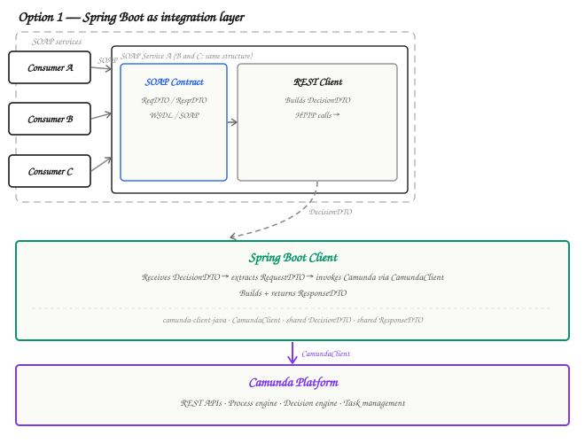
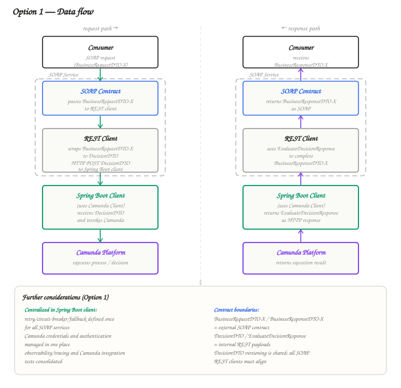
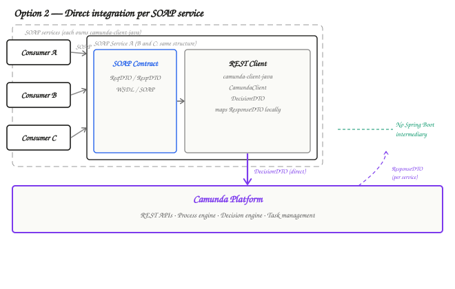
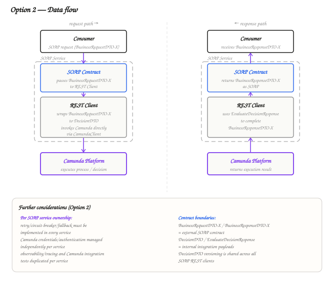
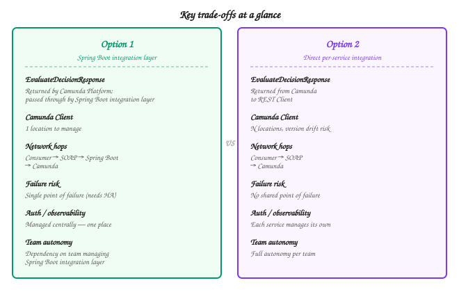

# Web Services — Camunda Integration

## Table of Contents

1. [Option 1 — Spring Boot Client as Integration Layer](#option-1--spring-boot-client-as-integration-layer)
   - [Architecture](#architecture)
   - [Data Flow](#data-flow)
   - [Design Decisions and Separation of Concerns](#design-decisions-and-separation-of-concerns)
2. [Option 2 — Direct Integration per SOAP Service](#option-2--direct-integration-per-soap-service)
   - [Architecture](#architecture-1)
   - [Data Flow](#data-flow-1)
   - [Design Decisions and Separation of Concerns](#design-decisions-and-separation-of-concerns-1)
3. [Comparison](#comparison)
   - [Data Flow Comparison](#data-flow-comparison)
   - [Key Trade-offs](#key-trade-offs)
   - [Additional Considerations](#additional-considerations)

---

## Option 1 — Spring Boot Client as Integration Layer

### Architecture

Each SOAP service contains two internal components:

- **SOAP Contract** — exposes `RequestDTO` and `ResponseDTO` to consumers via WSDL/SOAP. This is the public interface owned by the SOAP service.
- **REST Client** — an internal component responsible for constructing a `DecisionDTO` (embedding the `RequestDTO`) and calling the Spring Boot client's REST endpoints.

The **Spring Boot client** is a standalone application that acts as the single integration point between all SOAP services and the Camunda Platform. It owns `camunda-client-java` and uses the `CamundaClient` class to invoke Camunda REST APIs.

---

### Data Flow

#### Key data flow rules

> - `RequestDTO` is **embedded inside** `DecisionDTO` before the REST call. It is not sent as a separate payload.
> - `ResponseDTO` is built **once** inside Spring Boot and passed through the SOAP service unchanged. No re-mapping occurs inside the SOAP service.
> - `DecisionDTO` and `ResponseDTO` are **shared contracts** between the SOAP services and the Spring Boot client. They must be agreed upon and versioned together.

---

### Design Decisions and Separation of Concerns

#### Separation of concerns

| Layer | Responsibility | Owned by |
|---|---|---|
| SOAP contract | Public interface with consumers — `RequestDTO`, `ResponseDTO`, WSDL/SOAP binding | Each SOAP service |
| REST client (inside SOAP service) | Translates SOAP request into a `DecisionDTO` REST call toward Spring Boot | Each SOAP service |
| Spring Boot client | Receives `DecisionDTO`, extracts `RequestDTO`, invokes Camunda, builds and returns `ResponseDTO` | Dedicated Spring Boot application |
| `CamundaClient` | REST client abstraction provided by `camunda-client-java`; handles HTTP communication with Camunda Platform | Spring Boot client only |
| Camunda Platform | Process execution, decision evaluation, task management | Camunda Platform |

#### Design decisions

**Centralised Camunda coupling.** `camunda-client-java` and `CamundaClient` are dependencies of the Spring Boot application only. None of the SOAP services have a direct dependency on Camunda libraries. This means upgrades to `camunda-client-java`, changes in Camunda API versions, or changes in authentication only require updates in one place.

**`DecisionDTO` as the integration contract.** The `DecisionDTO` is the contract between the SOAP services and the Spring Boot client. Each SOAP service is responsible for constructing a valid `DecisionDTO` (with its `RequestDTO` embedded) before calling Spring Boot. The Spring Boot client is responsible for knowing how to interpret it.

**`ResponseDTO` as a pass-through.** The Spring Boot client owns the construction of `ResponseDTO`. The SOAP service's REST client receives it and passes it through without modification. This prevents duplication of mapping logic across services.

**Single point of failure trade-off.** Because all SOAP services route through the Spring Boot client, it becomes a single point of failure. This must be addressed through high-availability deployment (multiple instances, load balancing, health checks).

**SOAP contract independence.** Each SOAP service's `RequestDTO` and `ResponseDTO` are its own concern, defining the interface it exposes to its consumers over SOAP/WSDL. These are independent per service and do not need to be identical.

---

## Option 2 — Direct Integration per SOAP Service

### Architecture

Each SOAP service contains two internal components:

- **SOAP Contract** — exposes `RequestDTO` and `ResponseDTO` to consumers via WSDL/SOAP. Identical role to Option 1.
- **REST Client** — an internal component that owns `camunda-client-java` and uses `CamundaClient` to call Camunda Platform directly. It is also responsible for constructing `DecisionDTO` and mapping Camunda results into `ResponseDTO`.

There is no Spring Boot intermediary. Each SOAP service integrates independently with Camunda.

---

### Data Flow

#### Key data flow rules

> - `RequestDTO` is **embedded inside** `DecisionDTO` inside the SOAP service's REST client — same pattern as Option 1.
> - `ResponseDTO` is built **inside each SOAP service's REST client**, not in a shared location. Each service independently maps the Camunda result into its own `ResponseDTO`.
> - There is **no shared `ResponseDTO`** construction logic. If the mapping changes, it must be updated in every SOAP service independently.
> - `camunda-client-java` and `CamundaClient` are dependencies of **every** SOAP service.

---

### Design Decisions and Separation of Concerns

#### Separation of concerns

| Layer | Responsibility | Owned by |
|---|---|---|
| SOAP contract | Public interface with consumers — `RequestDTO`, `ResponseDTO`, WSDL/SOAP binding | Each SOAP service |
| REST client (inside SOAP service) | Builds `DecisionDTO`, calls Camunda via `CamundaClient`, maps result to `ResponseDTO` | Each SOAP service |
| `CamundaClient` | REST client abstraction provided by `camunda-client-java` | Each SOAP service independently |
| Camunda Platform | Process execution, decision evaluation, task management | Camunda Platform |

#### Design decisions

**Decentralised Camunda coupling.** Each SOAP service owns `camunda-client-java` and manages its own `CamundaClient` instance. This gives each service team full autonomy over how and when they upgrade, but creates duplication of dependency management across all services.

**`ResponseDTO` mapping is per service.** Each SOAP service is responsible for mapping the Camunda result into its own `ResponseDTO`. This is more flexible but means changes to the Camunda response schema require coordinated updates across all services.

**No shared integration layer.** There is no single application to maintain or deploy for Camunda integration. Each SOAP service is self-contained. This simplifies topology but distributes operational responsibility.

**Independent deployment.** Each SOAP service can evolve its Camunda integration at its own pace. One service can be on a different version of `camunda-client-java` than another.

**No single point of failure** (for the integration layer). The removal of the Spring Boot client means there is no central intermediary that can fail and take down all SOAP services simultaneously.

---

## Comparison

### Data Flow Comparison

| Step | Option 1 | Option 2 |
|---|---|---|
| Consumer calls service | SOAP request with `RequestDTO-X` | SOAP request with `RequestDTO-X` |
| `DecisionDTO` construction | Inside each SOAP service's REST client | Inside each SOAP service's REST client |
| Camunda invocation | Via Spring Boot client → `CamundaClient` | Directly via `CamundaClient` inside each SOAP service |
| `ResponseDTO` construction | Once, inside Spring Boot client | Independently, inside each SOAP service's REST client |
| `ResponseDTO` returned to consumer | Pass-through: Spring Boot → SOAP service → consumer | Built locally → SOAP service → consumer |
| Network hops (request) | Consumer → SOAP service → Spring Boot → Camunda | Consumer → SOAP service → Camunda |

---

### Key Trade-offs

#### Maintainability

**Option 1** centralises all Camunda integration logic in one place. When Camunda's API changes, authentication configuration changes, or `camunda-client-java` needs upgrading, only the Spring Boot client needs updating. In Option 2, the same change must be made in every SOAP service.

#### Latency

**Option 2** has one fewer network hop per request. For high-throughput scenarios this can be meaningful, though the difference is typically small compared to the cost of the Camunda operation itself.

#### Single point of failure

**Option 1** introduces the Spring Boot client as a single point of failure. If it goes down, all SOAP services lose their Camunda integration. This risk can be mitigated with clustering and health checks, but it must be explicitly designed for. **Option 2** has no such shared intermediary.

#### Operational complexity

**Option 1** adds one more application to the deployment topology, but consolidates the Camunda integration concern entirely. **Option 2** distributes the complexity into each SOAP service.

#### `camunda-client-java` dependency ownership

| Concern | Option 1 | Option 2 |
|---|---|---|
| Number of places `camunda-client-java` is declared | 1 (Spring Boot) | 1 per SOAP service (N total) |
| Version drift risk | None | Each service may independently drift |
| Upgrade coordination required | Only Spring Boot team | All SOAP service teams |

#### Autonomy vs. consistency

**Option 2** gives each SOAP service team full autonomy. **Option 1** enforces consistency through the shared Spring Boot client, but this means the Spring Boot team becomes a dependency for all SOAP service teams needing Camunda integration changes.

---

### Additional Considerations

#### Error handling and retry strategy

In **Option 1**, retry policies, circuit breakers, and fallback behaviour are defined once in the Spring Boot client and benefit all SOAP services uniformly. In **Option 2**, each SOAP service must implement and maintain its own error handling strategy toward Camunda.

#### Security and authentication

In **Option 1**, credentials are managed in one place (Spring Boot). In **Option 2**, every SOAP service must independently manage Camunda credentials, increasing the surface area for credential misconfiguration or leakage.

#### `DecisionDTO` versioning

`DecisionDTO` is a shared contract in both options. If its structure changes, all SOAP services must update their REST clients. This versioning concern applies equally to both options.

#### Observability and tracing

In **Option 1**, all Camunda calls pass through a single application, making it straightforward to add centralised logging, metrics, and distributed tracing. In **Option 2**, observability must be independently added to each SOAP service's REST client.

#### Testing

**Option 1** allows integration testing of the Camunda interaction to be consolidated in the Spring Boot client's test suite. **Option 2** requires each SOAP service to own a full integration test suite against Camunda.

#### Recommended option

> **Option 1 is recommended** when the SOAP services are maintained by the same team or organisation, Camunda API stability and upgrade management is a priority, or centralised observability and security are important. The Spring Boot client adds a deployment concern but pays for itself through reduced duplication and easier maintenance.

> **Option 2 is appropriate** when SOAP services are owned by fully independent teams with no shared deployment pipeline, service autonomy is prioritised over consistency, or the number of SOAP services is small and unlikely to grow.
